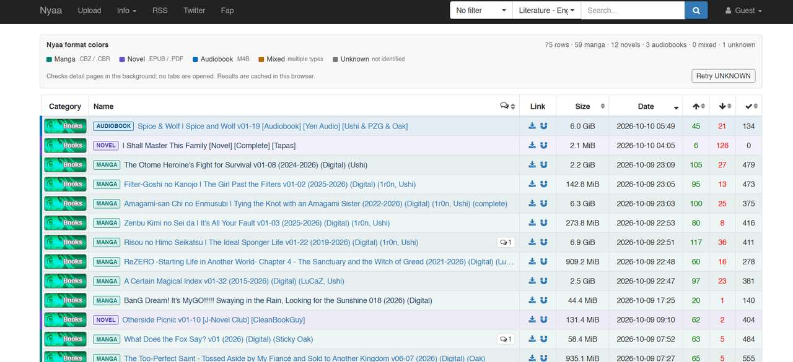

# Nyaa.si Literature RSS & Format Classifier

Turn Nyaa.si's mixed **Literature / English-translated** category into separate RSS feeds for **Manga, Novels, and Audiobooks** — plus color-coded format labels right on Nyaa.si.

## 📚 Subscribe to a feed

Add a feed to your RSS reader or ruTorrent.

| Type | Detects | RSS feed |
|---|---|---|
| 🟩 **Manga** | `.cbz`, `.cbr` | [Subscribe](https://raw.githubusercontent.com/chintu-io/nyaa-si-literature-rss/main/feeds/manga.xml) |
| 🟪 **Novels** | `.epub`, `.pdf` | [Subscribe](https://raw.githubusercontent.com/chintu-io/nyaa-si-literature-rss/main/feeds/novels.xml) |
| 🟦 **Audiobooks** | `.m4b` | [Subscribe](https://raw.githubusercontent.com/chintu-io/nyaa-si-literature-rss/main/feeds/audiobooks.xml) |

- **Updated every 30 minutes.**
- Each feed includes up to the **latest 75 matching releases**.
- Feeds classify torrents by their listed file extensions. Mixed releases may appear in more than one feed.
- In ruTorrent, add the feed URL and configure an RSS rule if you want automatic downloads. Review the rule carefully before enabling it.

## 🎨 Nyaa.si userscript

See formats while browsing Nyaa — no extra tabs needed. The script checks torrent detail pages in the background, color-labels results, and caches detections in your browser.

**Color guide:** Manga = teal · Novel = purple · Audiobook = blue · Mixed = amber · Unknown = grey

### Demo

The summary bar counts detected formats, and **Retry UNKNOWN** lets you check entries the script could not classify.

### Install

1. Install [Tampermonkey](https://www.tampermonkey.net/).
2. Install or open the [Nyaa Literature Format Colors userscript](https://raw.githubusercontent.com/chintu-io/nyaa-si-literature-rss/main/nyaa-literature-format-colors.user.js).
3. Browse [Nyaa.si Literature / English-translated](https://nyaa.si/?f=0&c=3_1&q=).

## ℹ️ Notes

- **Unknown** means the file list couldn't be read or no supported extension was found. Use **Retry UNKNOWN** in the userscript to try again.
- PDF is treated as a novel/document format by extension, though some PDFs may contain manga scans.
- The feeds cover Nyaa.si's **Literature / English-translated** category.

---

[Source category](https://nyaa.si/?page=rss&c=3_1&f=0) · [GitHub Actions status](https://github.com/chintu-io/nyaa-si-literature-rss/actions/workflows/build-category-rss.yml) · [Report an issue](https://github.com/chintu-io/nyaa-si-literature-rss/issues/new)
